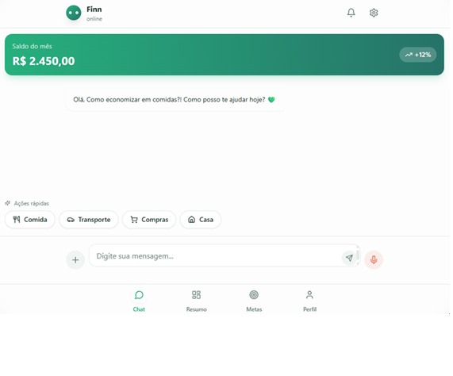
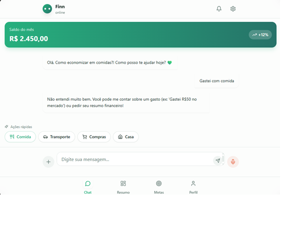
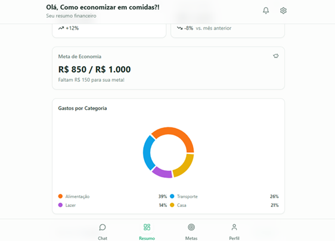

# 🚀 DIO Lab Vibe Coding - App de Finanças Pessoais com IA

## 📋 Resumo do Projeto

Este é um aplicativo inovador de **controle de finanças pessoais baseado em conversas (chat)**, desenvolvido como parte do desafio DIO Lab Vibe Coding. O app utiliza **Inteligência Artificial** para simplificar o registro de gastos, transformando uma tarefa tediosa em uma interação natural e conversacional.

### Problema Identificado
A maior causa de abandono em ferramentas de controle financeiro é a **fricção de entrada**. Em vez de abrir uma planilha e preencher cinco campos, o usuário apenas diz: *"Gastei 50 reais com pizza agora"*.

---

## 🎯 PRD - Product Requirements Document

### # Contexto
Quero criar um aplicativo de **Organização de Finanças Pessoais** que funcione por meio de conversas com o usuário.  
A ideia é facilitar o controle financeiro de forma simples e natural, **sem formulários manuais ou planilhas complexas**.

### # Problema
Muitas pessoas desistem de controlar seus gastos porque os apps atuais exigem muita entrada manual e pouca personalização.  
**A solução**: uma experiência de conversa com recomendações automáticas de economia.

**Causa raiz**: A maior causa de abandono em ferramentas de controle financeiro é a **fricção de entrada**. Em vez de abrir uma planilha e preencher cinco campos, o usuário apenas diz: *"Gastei 50 reais com pizza agora"*.

### # Público-Alvo
Pessoas que querem começar a organizar suas finanças de forma **prática e sem complicação**, principalmente iniciantes que:
- Têm dificuldade com planilhas complexas
- Querem algo rápido e intuitivo
- Buscam educação financeira junto com a ferramenta
- Precisam de lembretes e dicas personalizadas

### # Funcionalidades-Chave

1. **Registrar gastos via chat em linguagem natural**
   - Usuário digita: "Almoço hoje deu 35 reais"
   - App entende e processa automaticamente

2. **Classificar automaticamente as transações**
   - NLP identifica categoria (Alimentação, Transporte, etc.)
   - Aprende padrões do usuário para sugestões futuras

3. **Definir e acompanhar metas financeiras**
   - Usuário define orçamento mensal por categoria
   - Visualiza progresso com barras de andamento

4. **Receber dicas de economia do "Agente Financeiro"**
   - Notificações inteligentes: "Você já gastou 80% do orçamento de delivery"
   - Sugestões personalizadas baseadas no comportamento

5. **Visualizar relatórios simples e personalizados**
   - Gráficos de categorias de gastos
   - Dashboard com resumo do mês
   - Insights sobre padrões de consumo

### # Estrutura de Telas do MVP

**1. Onboarding (Boas-vindas)**
   - Fluxo rápido onde o "Agente" se apresenta
   - Pergunta o nome do usuário e sua principal meta (ex: sair das dívidas ou economizar)
   - Define orçamento inicial

**2. Tela de Chat (Principal)**
   - Interface central com histórico de conversas
   - Campo de texto/voz para registrar gastos e fazer perguntas
   - Feedback em tempo real das transações

**3. Dashboard de Resumo**
   - Gráfico de "rosca" com categorias de gastos
   - Barra de progresso para a meta definida
   - Insights visuais sobre o comportamento de gastos

**4. Configurações/Metas**
   - Ajuste do orçamento mensal
   - Visualização das categorias automáticas
   - Personalização de preferências

### # Recursos Técnicos Necessários (O "Cérebro" do App)

1. **Processamento de Linguagem Natural (NLP)**
   - Entender que "50 conto no posto" significa: Valor: 50,00 | Categoria: Transporte/Combustível
   - Parsing de valores e contexto

2. **Mecanismo de Classificação**
   - Lógica que aprende com o comportamento do usuário
   - Se ele sempre registra "Padaria do Zé" como lazer, o app sugere essa categoria
   - Ajuste de categorias baseado em feedback

3. **Banco de Dados**
   - Armazenar transações de forma segura
   - Organização por data, categoria e usuário
   - Histórico de conversas

4. **Motor de Insights (O Agente)**
   - Gatilhos de lógica que enviam notificações úteis
   - Exemplo: "Você já gastou 80% do seu orçamento de delivery este mês. Que tal cozinhar hoje?"
   - Análise de padrões para recomendações

### # Fluxo de Experiência do Usuário

```
ENTRADA
  ↓
Usuário digita: "Almoço hoje deu 35 reais"
  ↓
PROCESSAMENTO
  ↓
Sistema identifica:
  • Valor: 35,00
  • Categoria: Alimentação
  • Data: Hoje
  ↓
FEEDBACK
  ↓
Chat responde:
"Anotado! 35,00 em Alimentação 🍽️
Você ainda tem R$ 200,00 para gastar nessa categoria este mês.
Vão 5 refeições nesse ritmo! 📊"
```

### # Métricas de Sucesso para o MVP

- **Retenção de 7 dias**: Quantos usuários continuam registrando gastos após a primeira semana?
- **Taxa de Erro de Categoria**: Com que frequência o usuário precisa corrigir a classificação?
- **Engajamento com Dicas**: O usuário interage quando o "Agente" dá uma dica de economia?
- **Velocidade de Registro**: Quanto tempo leva para registrar um gasto? (Meta: < 10 segundos)

### # Entregável da IA (Copilot/Lovable)

Gerar um plano de MVP com:
- ✅ Principais telas do app
- ✅ Recursos necessários
- ✅ Esboço de validação inicial (teste do Mágico de Oz)
- ✅ Ton educativo e linguagem acessível em português

---

## 📸 Interações com Copilot/Lovable

Aqui você pode adicionar screenshots ou vídeos das suas interações:

### Screenshots

#### Tela de Onboarding

*Boas-vindas e apresentação do Agente Financeiro*

#### Tela de Chat (Principal)

*Interface de conversa para registrar gastos*

#### Dashboard de Resumo

*Visualização de gastos e progresso das metas*

#### Configurações e Metas

*Ajuste de orçamento e personalização*


### Vídeos
- [Vídeo Demo - Interação com Chat]

*Nota: Adicione as imagens/vídeos na pasta `./assets/` e crie links para elas aqui*

---

## 💡 Conceito do App

### O Diferencial

Este não é apenas um "formulário disfarçado de chat". O objetivo é:

✅ **Reduzir fricção**: Conversa natural vs. preenchimento de formulários  
✅ **Inteligência contextual**: NLP entende gastos descritos de forma orgânica  
✅ **Aprendizado progressivo**: Categoriza automaticamente com base em padrões  
✅ **Feedback em tempo real**: O usuário vê imediatamente o impacto na meta  
✅ **Agente ativo**: Notificações inteligentes e dicas personalizadas  

### Validação Inicial (Teste do Mágico de Oz)

Antes de construir o app completo:
1. Criar grupo de teste (5-10 pessoas)
2. Usuários enviam gastos via WhatsApp/Telegram
3. "Backend" manual (script ou você mesmo) atua como bot
4. Após uma semana: Feedback sobre facilidade vs. apps tradicionais

---

## 🎓 Reflexão - O que Aprendi no Processo

### Principais Aprendizados

1. **Design Thinking Aplicado**
   - Entender o problema real (fricção de entrada) é mais importante que features
   - MVP deve focar em resolver UMA coisa muito bem

2. **Potencial da IA em UX**
   - Chat é uma interface intuitiva que reduz barreiras
   - NLP bem aplicada pode fazer a diferença na experiência do usuário

3. **Validação antes de Desenvolvimento**
   - O teste do Mágico de Oz é validação eficiente e barata
   - Evita meses de desenvolvimento em direções erradas

4. **Importância da Linguagem Natural**
   - Usuários pensam em linguagem natural, não em estruturas de dados
   - Ao traduzir isso, a ferramenta fica muito mais útil

5. **Agente como Personagem**
   - Um agente com personalidade cria engajamento
   - Dicas e notificações não são features, são interações significativas

6. **Escalabilidade Gradual**
   - Começar com chat simples, evoluir para ML com dados reais
   - Não precisa ser perfeito no dia 1

### Sobre Usar IA (Copilot/Lovable) no Processo

- **Velocidade**: Prototipagem muito mais rápida
- **Criatividade**: IA sugere abordagens que talvez eu não pensasse
- **Refinamento**: Iteração rápida com feedback direto
- **Aprendizado**: Vejo como a IA resolve problemas e absorvo técnicas

---

## 🛠️ Tecnologias Utilizadas

- **Frontend**: Lovable
- **IA/NLP**: GPT/Claude via Copilot/Lovable
- **Ferramentas de Desenvolvimento**: VS Code, Copilot, Lovable

---

## 📝 Como Usar Este Projeto

1. Clone o repositório:
```bash
git clone https://github.com/marcosferreiracabral/dio-lab-vibe-coding-app-financas.git
```

2. Siga as instruções de setup (se houver `setup.md`)

3. Execute o projeto conforme as instruções locais

---

## 📚 Recursos Adicionais

- [DIO Lab - Vibe Coding Challenge](https://www.dio.me)
- [Repositório Original](https://github.com/digitalinnovationone/dio-lab-vibe-coding-app-financas)
- [Copilot Documentation](https://github.com/features/copilot)

---

## 👤 Autor

**Marcos Ferreira Cabral**  
GitHub: [@marcosferreiracabral](https://github.com/marcosferreiracabral)

---

## 📄 Licença

Este projeto é parte do desafio da Digital Innovation One (DIO).

---

**Desenvolvido com ❤️ usando Copilot e VSCode**
